# 5V SigGen —— 功率器件栅极驱动的双脉冲 / 多脉冲发波板

一句话：**给功率半导体栅极驱动和双脉冲（Double Pulse Test）测试用的硬件发波控制器。**

不是那种"输出任意波形"的通用信号发生器。这块板子只干一件事：在你设定的时刻，从 SMA 口吐出边沿干净、宽度精确到亚纳秒级的 5V 逻辑脉冲，并且在你把驱动板炸掉之前，用硬件把输出掐断。

主控 STM32G474CET6，靠 HRTIM1 高精度定时器出波形，128×128 OLED + 旋钮/摇杆本地调参，也能挂 USB-TTL 让电脑用 SCPI 远程遥控。


*实际录制：菜单翻页、数值弹窗编辑、触界回弹的动效。*

> 引脚、电气特性、网表依据一律以根目录 [`HARDWARE.md`](HARDWARE.md) 为准。本文只讲怎么用、为什么这么设计。

---

## 1. 它能干什么

- **7 种发波模式**：N 脉冲、N 长脉冲、双脉冲、PWM、长 PWM、互补 PWM、超长互补 PWM。
- **时间精度**：HRTIM1 八档自动分频，窄脉冲段跑到 5.44 GHz 等效时钟，单 tick **0.184 ns**。
- **双脉冲测试**：t1 脉宽 → 死区间隔 → t2 脉宽，三个参数直接数字填，不用你摆弄旋钮。
- **互补输出防直通**：死区由 HRTIM 硬件发生器插入（0~12000 ns），不是软件延时糊出来的。
- **示波器触发辅助**：Y7 每次触发同步吐一个 200 ns 脉冲，Y8 标记一帧猝发的起止。
- **硬件故障封锁**：外部故障信号拉低 PA15，HRTIM 在 ns 级把输出扣到无效电平，同时软件切断 12V。
- **参数掉电保存**：全部模式参数写进 Flash 末页，带 CRC 校验。
- **SCPI + 屏幕镜像**：USB-TTL 一线两用，既能 1:1 镜像 OLED，也能发文本命令 / 注入虚拟按键。

---

## 2. 硬件底子

| 项目 | 实际情况 |
|:---|:---|
| 主控 | STM32G474CET6，LQFP48，512 KB Flash |
| RAM | 96 KB（SRAM1 80K + SRAM2 16K，链接脚本实测映射）；另有 32 KB CCM SRAM **当前没用** |
| 主频 | HSE 24 MHz → PLL 170 MHz，VOS Scale1 Boost，Flash 4 等待周期 + ART 预取 |
| 发波定时器 | HRTIM1，Master 170 MHz，最高 `MUL32` = **5.44 GHz 等效时钟** |
| 波形输出 | Y1~Y6 = CH1~CH6，经 74LVCH8T245 电平转换后到 SMA |
| 显示 | 128×128 OLED（SSD1315 兼容），SPI1 + DMA |
| 输入 | EC12D 旋转编码器（TIM2 编码器模式）+ 五向摇杆，一律过 MAX6818 硬件消抖 |
| 供电 | USB-C PD（IP2721 诱骗 12V）或 2EDG 端子 → LTC4421 理想二极管 → NCV7805 出 5V → TLV76133 出 3.3V |
| 12V 负载输出 | TPS22810 ×2 并联，PA12 控制，从 J8 输出（给驱动板供电） |

### 2.1 输出电平是 5V 还是 3.3V，取决于贴片

74LVCH8T245（U8）的 B 侧电源 `VCCB` **不是死接 5V**，而是预留了两条支路：R64 → 5V、R65 → 3.3V。

- **只贴 R64** → 输出 5V（本板实测就是这个配置）
- **只贴 R65** → 输出 3.3V
- **禁止两颗同时焊**

软件改不了这个选择，想换电平必须动烙铁。示波器实测输出高电平 **5.03~5.09 V**，低电平 **-20~-50 mV**（1 MΩ 输入、20 MHz 带宽限制下测的），过冲很小。

### 2.2 输出端是串联电阻做的端接

MCU 引脚经 U8 缓冲后，每一路都串了一个电阻（R49~R56，原理图标 20 Ω）再进 SMA。**网表里不带阻值，最终以 BOM 为准。**

这里要说明白：74LVCH8T245 是总线收发器，不是有明确输出阻抗的线驱动器，所以它**不构成严格的 50 Ω 源端匹配**。实测边沿过冲很小（高电平最高 5.09 V，基本没有振铃），是串联电阻 + SMA 短线共同的结果。如果你的负载环境更恶劣，这个电阻值有调整空间。

> **TODO（缺图）**：整板实物照片（正面 / 背面各一张），以及 SMA 输出到驱动板的接线示意照片。目前 `screenshots/` 里只有屏幕截图和示波器截图，没有板子本身的照片。

---

## 3. 通道映射

Timer C 已经从发波里剥离，改成专用辅助信号（`Pulse.h` 定义的 `SYNC_OUT_Pin` / `FRAME_OUT_Pin`）。

| 逻辑通道 | HRTIM 通道 | MCU 引脚 | SMA | 说明 |
|:---|:---|:---|:---|:---|
| CH1 | HRTIM1_CHB2 | PA11 | Y1 | |
| CH2 | HRTIM1_CHB1 | PA10 | Y2 | |
| CH3 | HRTIM1_CHA2 | PA9 | Y3 | |
| CH4 | HRTIM1_CHA1 | PA8 | Y4 | |
| CH5 | HRTIM1_CHD2 | PB15 | Y5 | |
| CH6 | HRTIM1_CHD1 | PB14 | Y6 | |
| **SYNC OUT** | HRTIM1_CHC2 | PB13 | **Y7** | 每次触发输出 200 ns 同步脉冲 |
| **帧标记** | 软件 GPIO | PB12 | **Y8** | 猝发开始拉高、结束拉低 |

互补模式的通道对是固定的——因为硬件上必须是同一个 Timer 的 Tx1/Tx2：

| 通道对 | 定时器 | 主路 | 互补路 |
|:---|:---|:---|:---|
| `CH1&CH2 (Timer B)` | Timer B | CH1 (TB2) | CH2 (TB1) |
| `CH3&CH4 (Timer A)` | Timer A | CH4 (TA1) | CH3 (TA2) |
| `CH5&CH6 (Timer D)` | Timer D | CH6 (TD1) | CH5 (TD2) |

---

## 4. 七种发波模式

### 4.1 HRTIM 自动分频档

窄脉冲和高精度不是靠一个分频比硬撑出来的。代码按目标时间自动选档（`Pulse.c` 的 `Pulse_CalcPrescalerAndCounts`）：

| 目标时间 | 分频比 | 等效时钟 | 单 tick |
|:---|:---|:---|:---|
| ≤ 11.8 µs | `MUL32` | 5.44 GHz | **0.184 ns** |
| ≤ 23.8 µs | `MUL16` | 2.72 GHz | 0.368 ns |
| ≤ 47.9 µs | `MUL8` | 1.36 GHz | 0.735 ns |
| ≤ 96.0 µs | `MUL4` | 680 MHz | 1.47 ns |
| ≤ 192.4 µs | `MUL2` | 340 MHz | 2.94 ns |
| ≤ 385.1 µs | `DIV1` | 170 MHz | 5.88 ns |
| ≤ 770.4 µs | `DIV2` | 85 MHz | 11.76 ns |
| 其它 | `DIV4` | 42.5 MHz | 23.53 ns |

计数值钳在 96 ~ 65503 之间——下限 96 是为了避开比较值过小导致的边沿劣化，上限是硬件计数器的物理天花板。

死区发生器另有自己的一套分频（和上面的波形分频互相独立），9 bit 计数，最大 12000 ns。

### 4.2 参数速查表

数值类选项的存储都是**整数放大**（比如 2 位小数存 `/100`），所以下面给出实际可调范围。

#### Multi Pulse（N 脉冲，短）

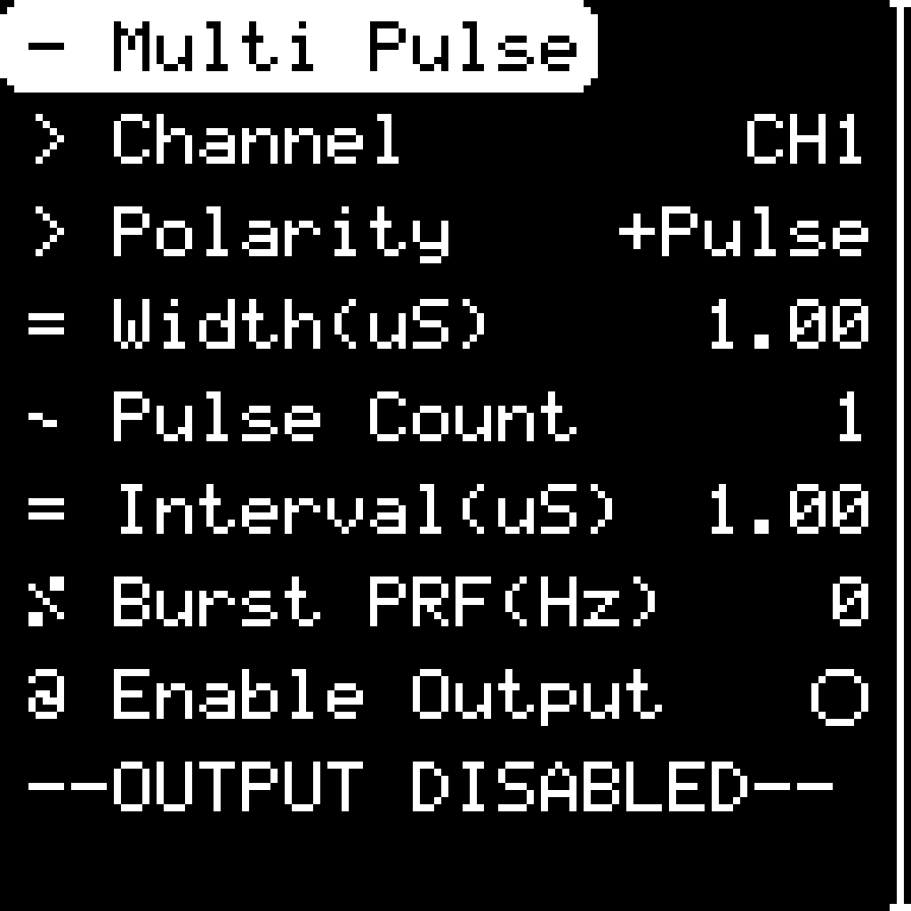

| 行 | 范围 | 默认 | 备注 |
|:---|:---|:---|:---|
| `> Channel` | CH1~CH6 | CH1 | 切换会**重置本页参数为默认值** |
| `> Polarity` | `+Pulse` / `-Pulse` | +Pulse | |
| `= Width(uS)` | 0.01 ~ 1500.00 µs | 1.00 | 按位微调，无固定步进 |
| `~ Pulse Count` | 1 ~ 100 | 1 | 滑动调值，步进 1 |
| `= Interval(uS)` | 1.00 ~ 1500.00 µs | 1.00 | **两脉冲之间的低电平间隔**，见 §4.4 |
| `% Burst PRF(Hz)` | 0 ~ 100000 | 0 | **0 = 单次触发**；>0 = 按此频率自动周期猝发 |
| `@ Enable Output` | 开 / 关 | 关 | |

#### Multi Pulse Long（N 长脉冲）

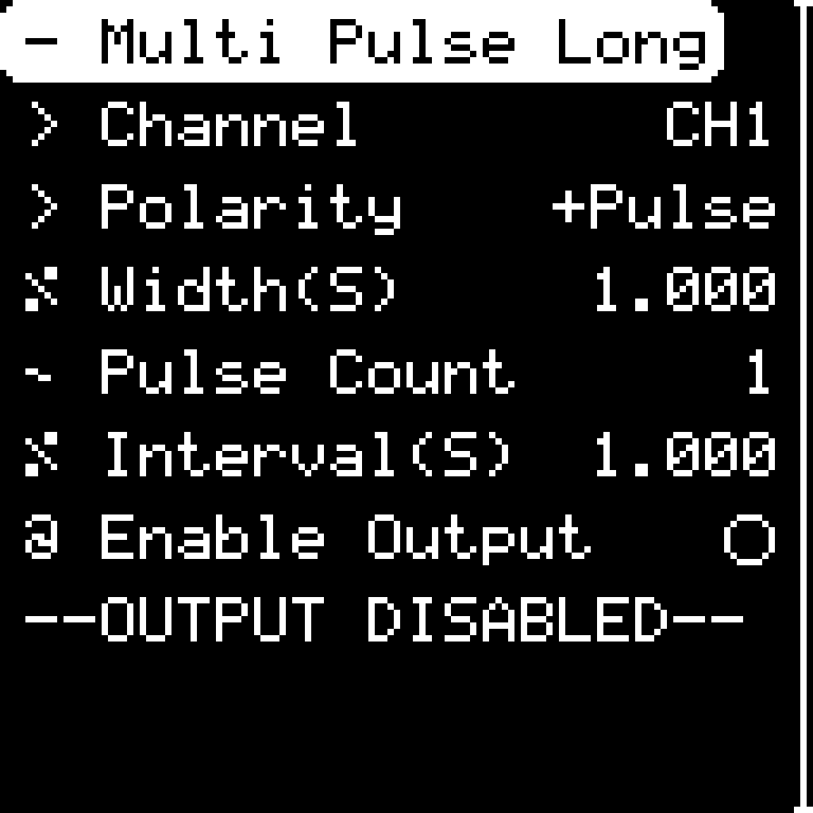

| 行 | 范围 | 默认 | 备注 |
|:---|:---|:---|:---|
| `> Channel` / `> Polarity` | 同上 | CH1 / +Pulse | |
| `% Width(S)` | 0.001 ~ 1000.000 s | 1.000 | |
| `~ Pulse Count` | 1 ~ 100 | 1 | |
| `% Interval(S)` | 0.001 ~ 100.000 s | 1.000 | 范围比 Width 窄，注意 |
| `@ Enable Output` | 开 / 关 | 关 | |

实现上走 TIM5 软件翻转 GPIO，不是 HRTIM。

#### Double Pulse（双脉冲）

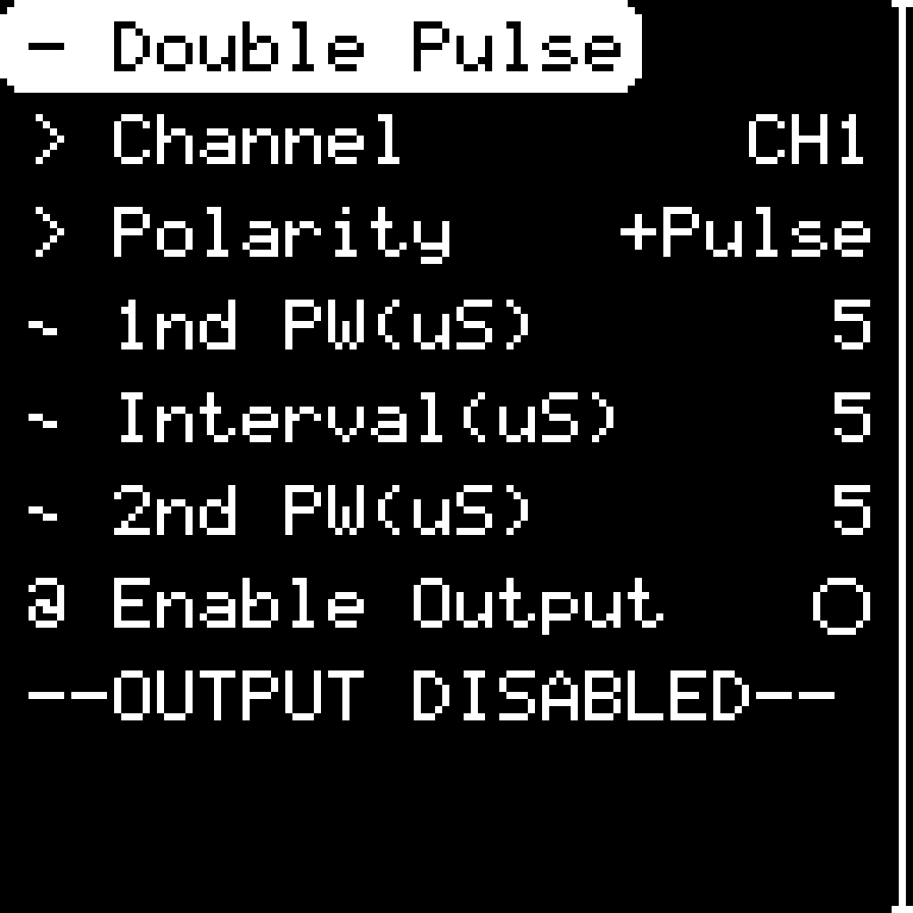

| 行 | 范围 | 默认 |
|:---|:---|:---|
| `> Channel` / `> Polarity` | 同上 | CH1 / +Pulse |
| `~ 1nd PW(uS)` | 1 ~ 200 µs（整数） | 5 |
| `~ Interval(uS)` | 1 ~ 200 µs（整数） | 5 |
| `~ 2nd PW(uS)` | 1 ~ 200 µs（整数） | 5 |
| `@ Enable Output` | 开 / 关 | 关 |

注意这三项是**整数微秒**，没有小数——SCPI 用 `atoi` 解析，小数会被截断。

#### PWM

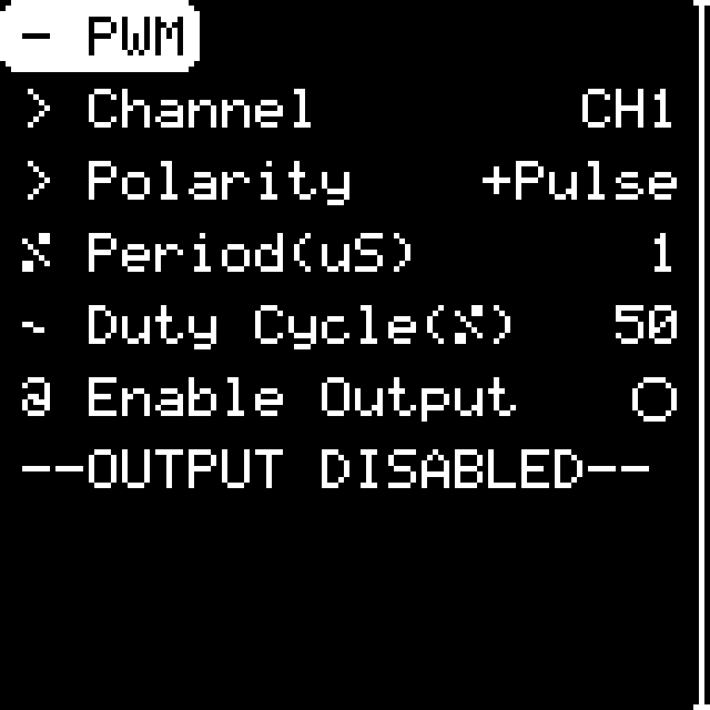

| 行 | 范围 | 默认 |
|:---|:---|:---|
| `> Channel` / `> Polarity` | 同上 | CH1 / +Pulse |
| `% Period(uS)` | 1 ~ 1500 µs（整数） | 1 |
| `~ Duty Cycle(%)` | 1 ~ 100 % | 50 |
| `@ Enable Output` | 开 / 关 | 关 |

连续发波——**使能输出就开始跑，不需要触发**。

#### PWM Long

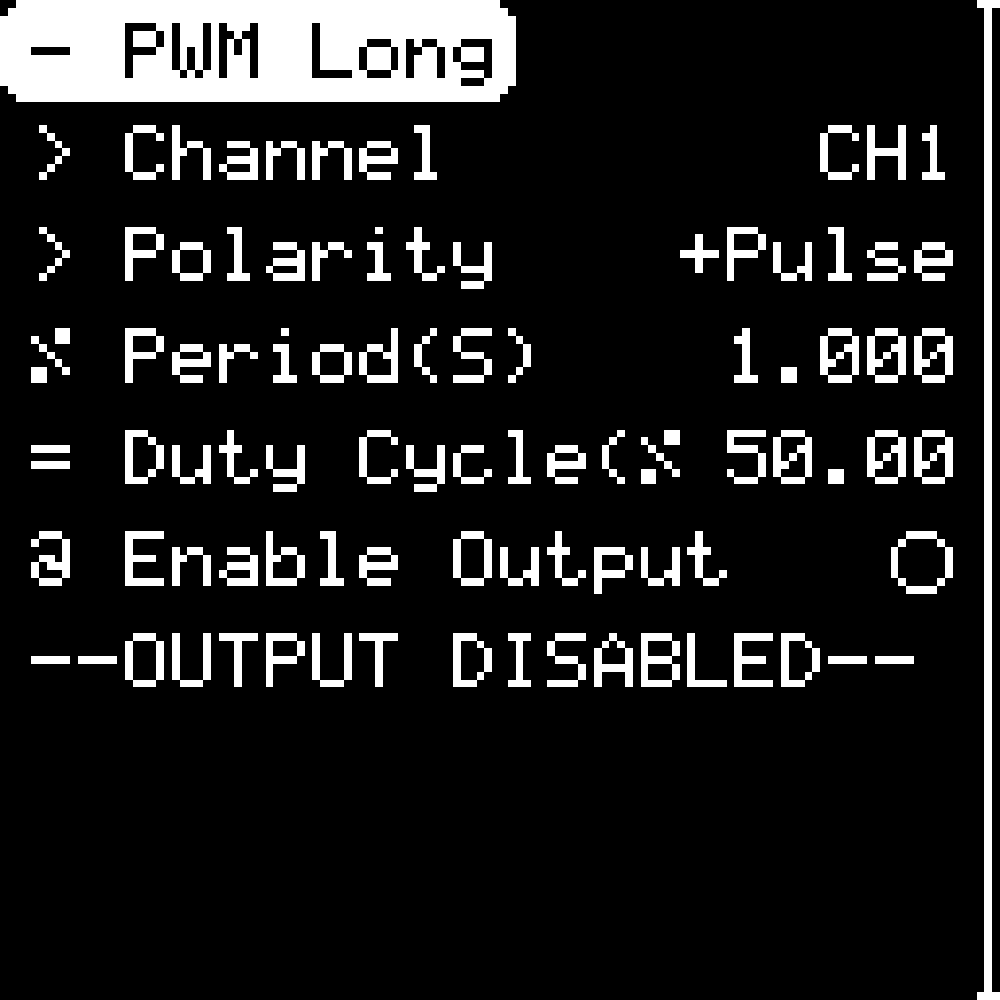

| 行 | 范围 | 默认 |
|:---|:---|:---|
| `> Channel` / `> Polarity` | 同上 | CH1 / +Pulse |
| `% Period(S)` | 0.001 ~ 1000.000 s | 1.000 |
| `= Duty Cycle(%)` | 0.01 ~ 100.00 % | 50.00 |
| `@ Enable Output` | 开 / 关 | 关 |

同样走 TIM5，使能即连续发波。

#### Comp PWM（互补 PWM，HRTIM）

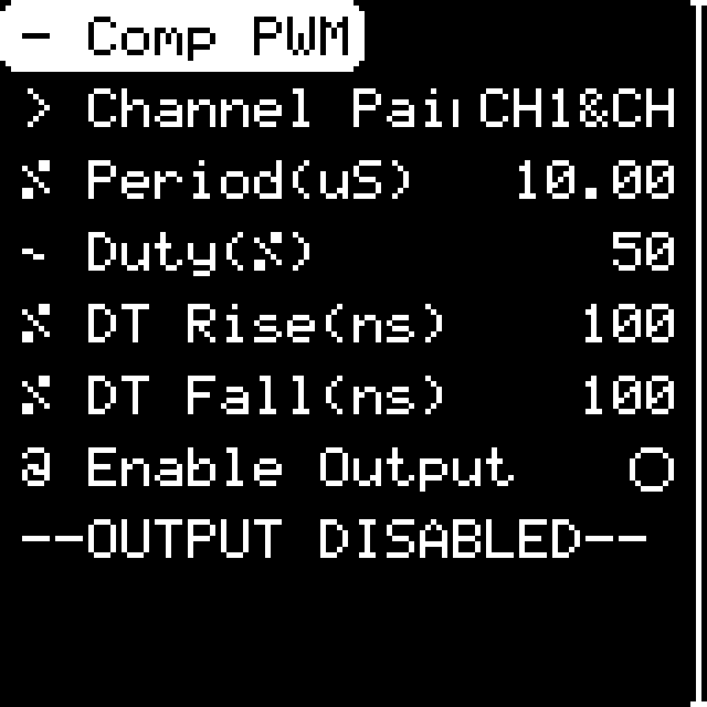

| 行 | 范围 | 默认 |
|:---|:---|:---|
| `> Channel Pair` | CH1&CH2(Timer B) / CH3&CH4(Timer A) / CH5&CH6(Timer D) | CH1&CH2 |
| `% Period(uS)` | 1.00 ~ 1500.00 µs | 10.00 |
| `~ Duty(%)` | 0 ~ 100 % | 50 |
| `% DT Rise(ns)` | 0 ~ 12000 ns | 100 |
| `% DT Fall(ns)` | 0 ~ 12000 ns | 100 |
| `@ Enable Output` | 开 / 关 | 关 |

**本模式没有 Polarity 行**——互补输出谈极性没意义。死区上升沿/下降沿可以分别设，这点对驱动不同栅极电阻的上下管很实用。

#### Comp PWM Long（超长互补）

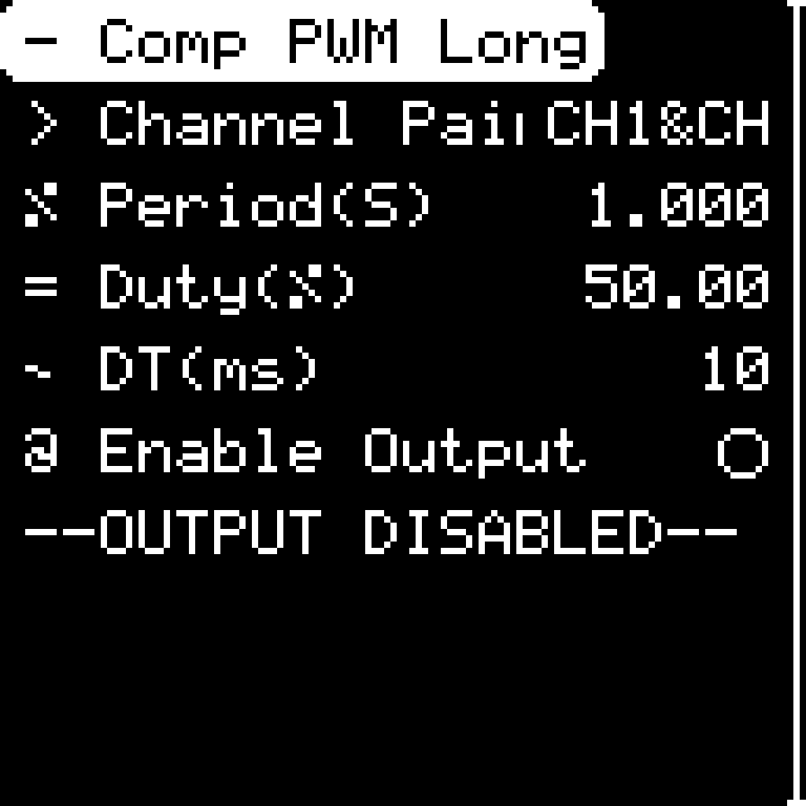

| 行 | 范围 | 默认 |
|:---|:---|:---|
| `> Channel Pair` | 同上 | CH1&CH2 |
| `% Period(S)` | 0.001 ~ 1000.000 s | 1.000 |
| `= Duty(%)` | 0.01 ~ 100.00 % | 50.00 |
| `~ DT(ms)` | 1 ~ 5000 ms | 10 |
| `@ Enable Output` | 开 / 关 | 关 |

这个是 TIM5 + 软件死区实现的，死区单位是**毫秒**，和上面 Comp PWM 的纳秒差三个数量级。做慢速大功率测试用。

### 4.3 实测波形

以下都是 SIGLENT 示波器实拍，探头 1×、1 MΩ、20 MHz 带宽限制，C1 黄色为输出。

**N 脉冲，1 µs 脉宽**（时基 200 ns/div）——实测正脉宽 **1.00022 µs**：

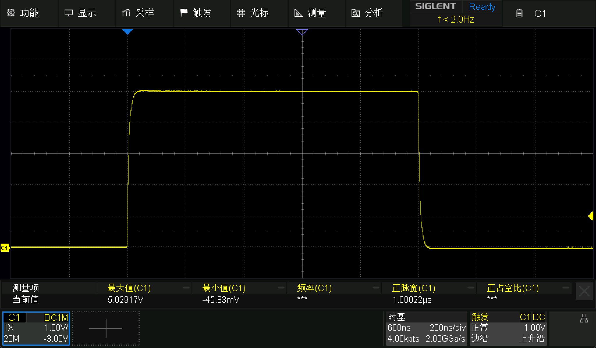

**N 脉冲，1 µs 脉宽 / 4 µs 间隔**（时基 2 µs/div）——实测正脉宽 **1.00028 µs**，频率 197.6677 kHz，即周期 5.06 µs ≈ 1 µs + 4 µs：

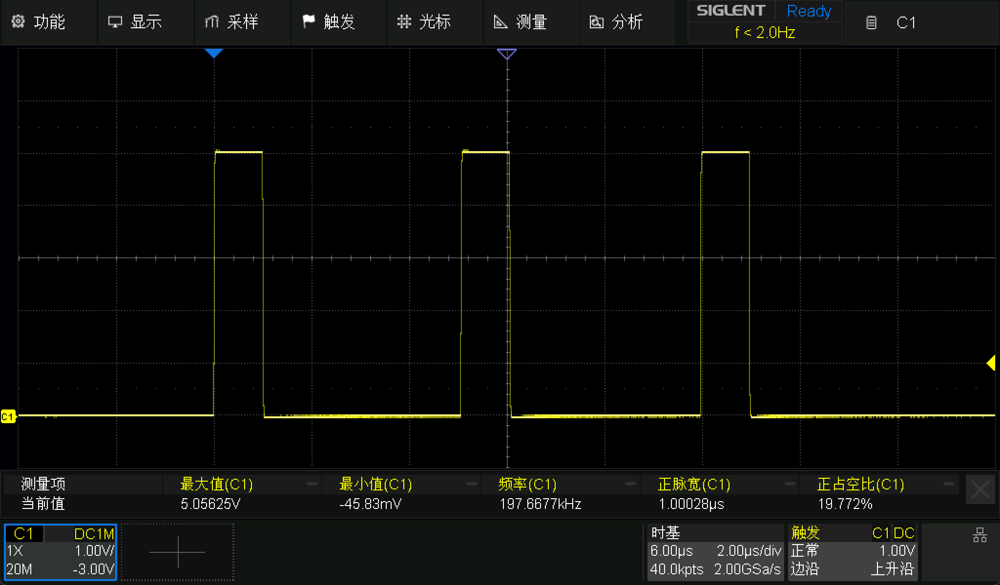

**多脉冲 + 10 kHz 猝发模式**（时基 50 µs/div）——群内脉冲仍是 197.2132 kHz，群重复 10 kHz：

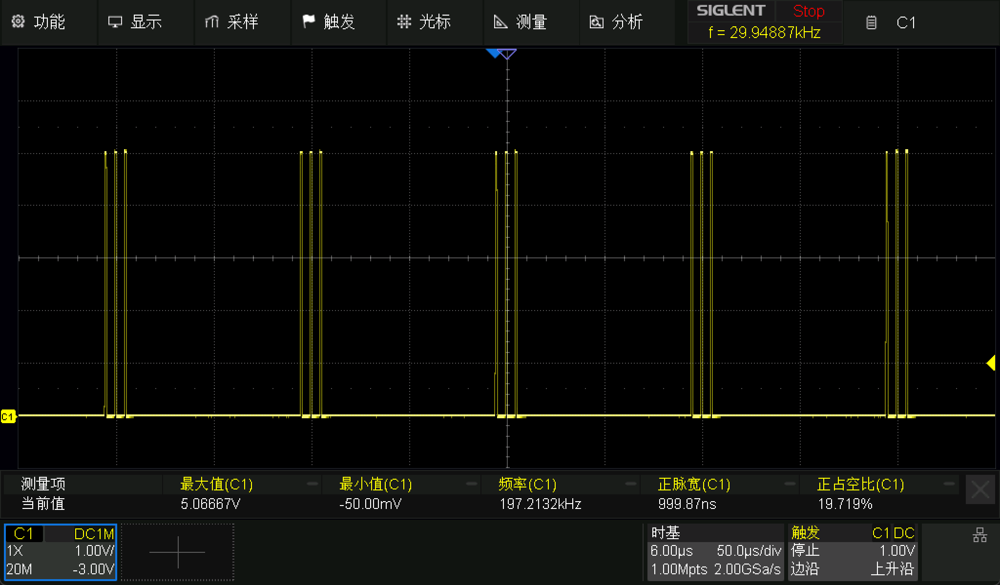

**N 长脉冲，1 s 脉宽 / 1 s 间隔**（时基 1 s/div）——实测正脉宽 **999.990 ms**，频率 500.005 mHz：

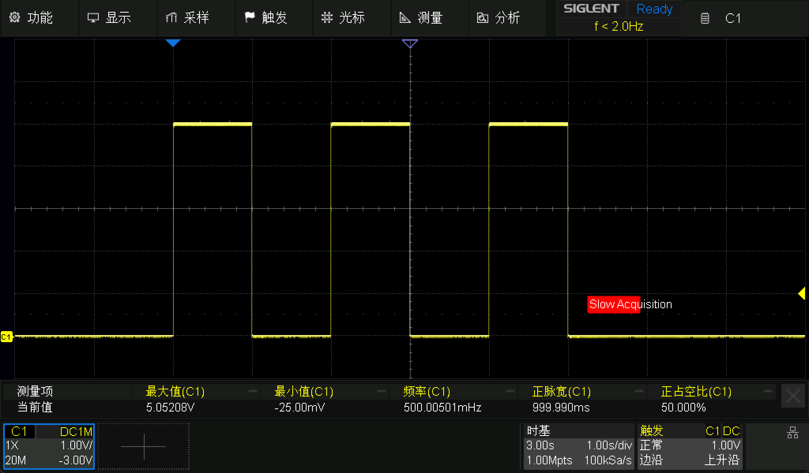

**长脉冲 1 s 单发**——实测正脉宽 **1.000000 s**：

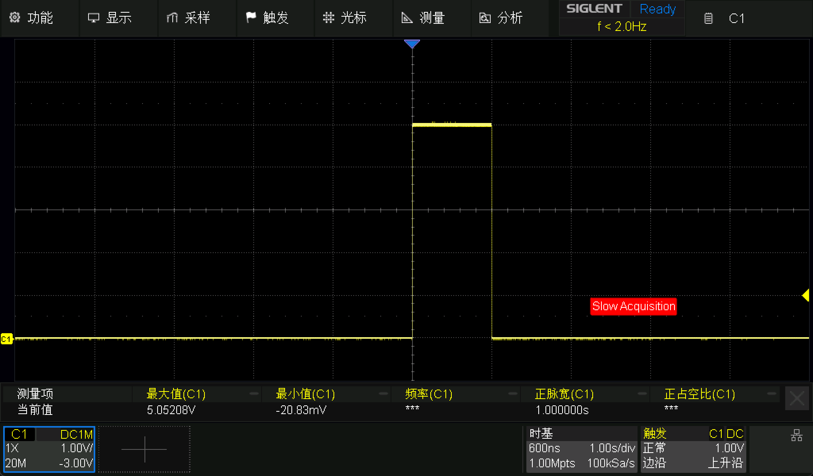

**双脉冲，10 µs 第一脉宽 / 5 µs 间隔 / 5 µs 第二脉宽**（时基 5 µs/div）——实测正脉宽 10.00063 µs，周期 15 µs 对应 66.665 kHz：

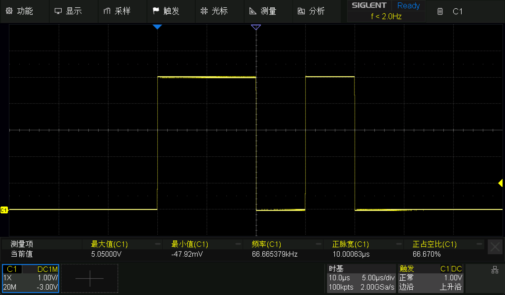

**PWM，1 µs 周期 / 50 %**（时基 1 µs/div）——实测频率 **1.000008 MHz**，正脉宽 500.28 ns，占空比 50.032 %：

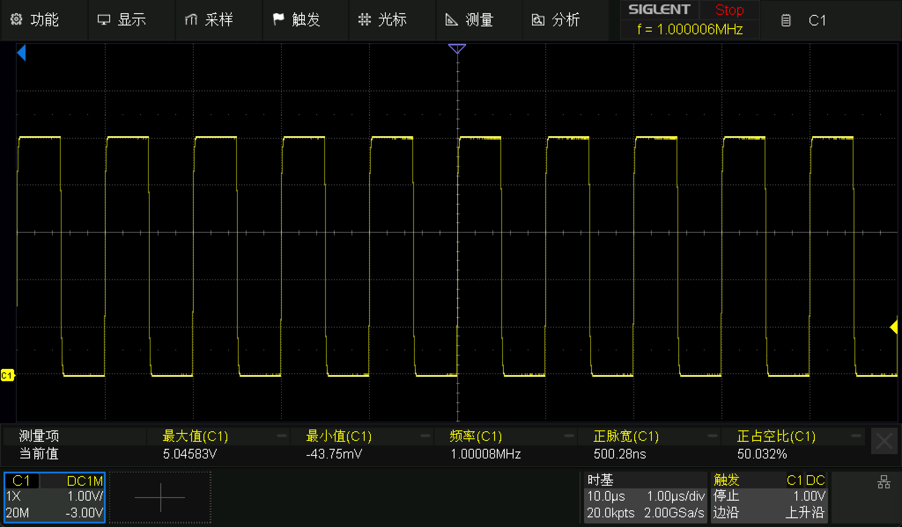

**长 PWM，1 s 周期 / 50 %**（时基 1 s/div）——实测正脉宽 500.000 ms，频率 999.99998 mHz：

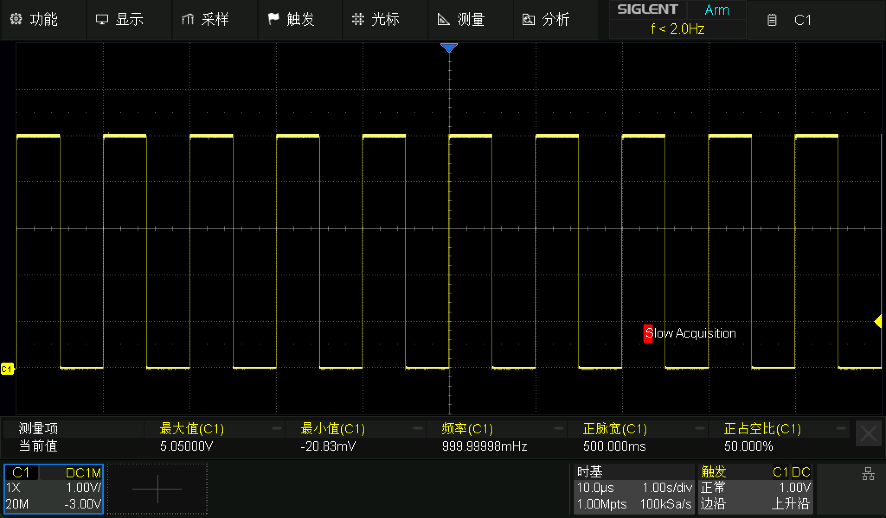

**互补 PWM，10 µs 周期 / 50 % / 100 ns 死区**（时基 2 µs/div）——C1 黄色主路实测正脉宽 **4.9005 µs**，比理想 5 µs 少掉的正好是 100 ns 死区。粉色 C2 是互补路：

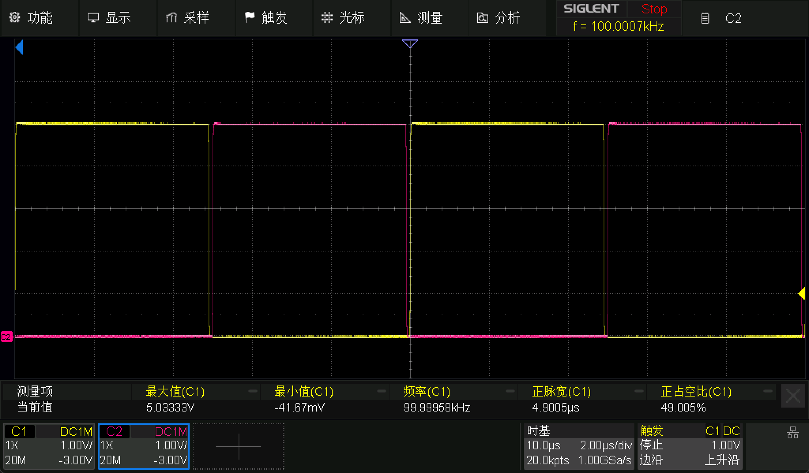

**超长互补，1 s 周期 / 50 % / 10 ms 死区**（时基 1 s/div）——主路实测正脉宽 **489.990 ms**，即 500 ms − 10 ms：

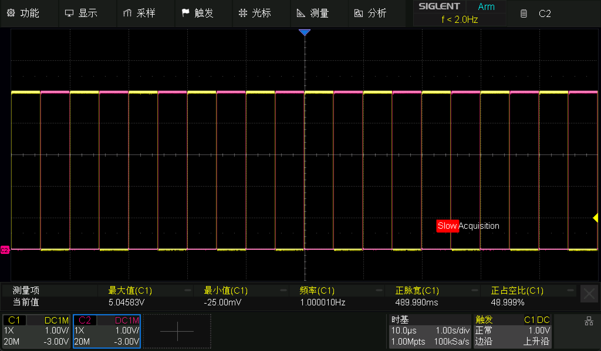

> 长时基那几张示波器会弹 `Slow Acquisition` 警告，属正常——采样率跟不上慢扫描，不是板子的问题。

### 4.4 多脉冲的 Interval 到底控制什么

这个坑踩过，值得单独说。**Interval 是两脉冲之间的低电平间隔，不是循环周期。**循环周期 = Width + Interval。

实测印证：设 1 µs 脉宽 + 4 µs 间隔，示波器读周期 5.06 µs，对上。

实现上有个细节：N 脉冲是靠 HRTIM「可重触发单次模式」+ CMP4 中断软件重发来连发的，中断响应 + 重触发本身有固定开销，会让实际间隔比设定值多出来。代码里做了补偿：

```c
/* 软件重触发方案的固定开销补偿: 每个脉冲间隙会多出中断响应 + TxRST 重触发的时间,
   实测稳定约 0.9us, (补偿后最小可实现实际间隔 ≈ 0.9us, 即该开销本身) */
#define NPULSE_INTERVAL_COMP_US   0.9f
#define NPULSE_INTERVAL_MIN_US    0.05f   /* 补偿后最小硬件间隔, 避免 tick 取整退化为 0 */
```

这个常量最初是 `2.0f`，实测后发现偏大，改成了 `0.9f`。所以你现在设多少，示波器上基本就读到多少。

---

## 5. 菜单与操作

主菜单 9 项，选完直接进发波页（`Setting` 除外）：

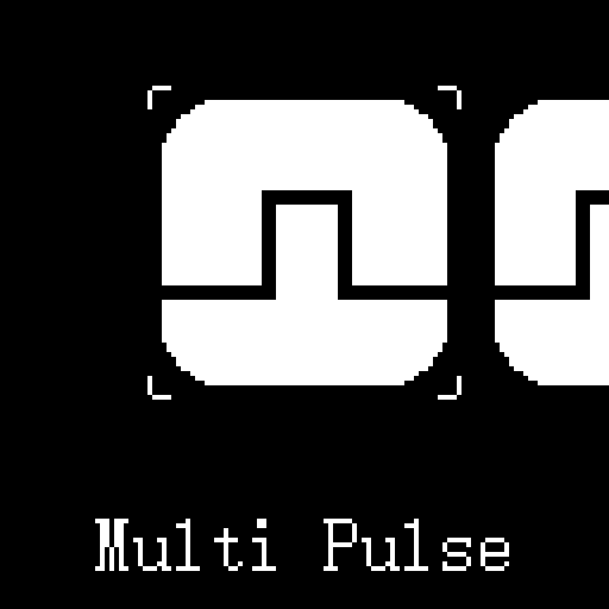

```
+ Multi Pulse
+ Multi Pulse Long
+ Double Pulse
+ PWM
+ PWM Long
+ Comp PWM
+ Comp PWM Long
+ Setting
! About
```

行首那个符号是 WouoUI 的控件类型标记：`>` 枚举选择、`=`/`%` 数值（按位微调）、`~` 数值（滑动调值）、`@` 开关/动作、`!` 动作。

`! About` 不跳页面，直接弹一个消息窗，写着 `Farshore / chenfangshuo / Powered by WouoUI Page`。

### 5.1 按键分工

| 输入 | 列表页 | 数值弹窗 |
|:---|:---|:---|
| 摇杆 上/下 | 上一项 / 下一项 | 增大 / 减小 |
| 摇杆 左/右 | 上一项 / 下一项 | 减小 / 增大（与 SpinWin 位选配合） |
| 旋钮旋转 | 上一项 / 下一项 | 未选中数字位：移动光标；已选中：调值 |
| 摇杆中键 / 旋钮中键 短按 | 确定 / 进入 | 切换「选中位」或写回退出 |
| 摇杆中键 / 旋钮中键 **长按 500 ms** | 返回上一级 | 返回 |

几个实际用起来才知道的点：

- **长按判据是 500 ms**（`KEY_TIME_LONG 50` × 10 ms）。不是"按一下就行"，想返回得按住。
- 摇杆四方向支持**连续重复**，长按不放每 300 ms 触发一次，翻长列表不用狂点。
- 数值弹窗分两种：`SpinWin` 是**按位微调**，选中小数点后某一位然后只加减那一位，适合快速从 1.00 跳到 100.00；`ValWin` 是**滑动调值**，老老实实加 step。脉宽/周期/间隔用前者，脉冲个数/占空比/死区(ms) 用后者。
- 编码器和摇杆滚轮调值方向做过专门处理，各自独立定方向，互相不干扰。

### 5.2 Setting 页

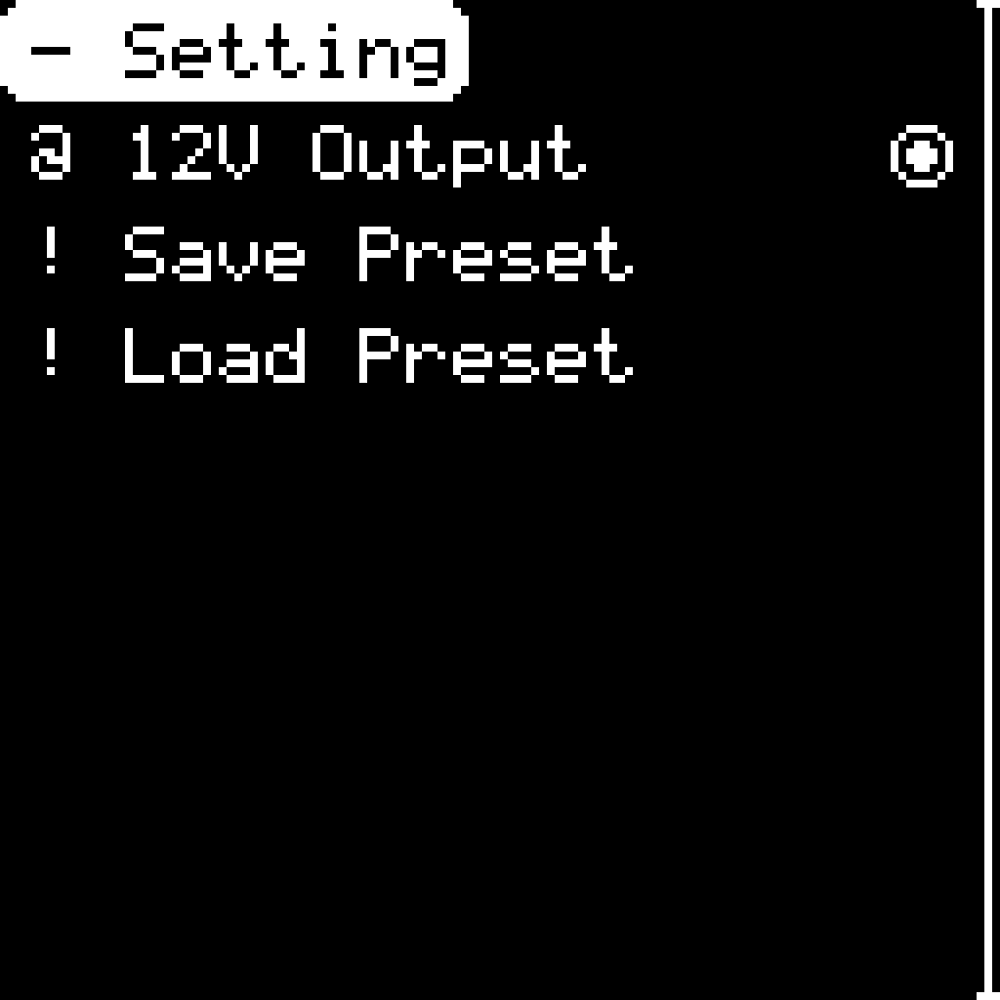

| 项 | 行为 |
|:---|:---|
| `@ 12V Output` | 12V_OUT 手动开关，**默认开** |
| `! Save Preset` | 存 Flash → `Preset Saved OK` / `Preset Save Failed` |
| `! Load Preset` | 读 Flash → `Preset Loaded OK` / `No Valid Preset` |

注意 `Save Preset` 存的是**当前所有模式的全部参数**，不是只存当前页。

### 5.3 改通道会重置参数

这是个容易踩的坑：**在 Channel / Channel Pair 里换一个选择，本页的波形参数会被重置成默认值。**

比如你在 Multi Pulse 里设好 100 µs / 20 个脉冲，然后想从 CH1 换到 CH3，一确认，脉宽又变回 1.00 µs、个数变回 1。代码里 `ChSelPage_CallBack` 就是这么写的——换通道等于换一套配置。

要保留参数就先用 `Save Preset`。

---

## 6. 防炸机与安全逻辑

这部分是这个项目里最该看的部分。发波板炸驱动板通常就两个原因：上下桥直通、或者上电/切换瞬间打出寄生脉冲。下面逐条对应。

### 6.1 三层保护

**第一层：HRTIM 硬件故障封锁。**
外部故障信号接在 **PA15 = HRTIM1_FLT2**（AF13，内部上拉，低有效，`Filter=2` 轻度滤波防毛刺）。一旦拉低，HRTIM 在**硬件层面、纳秒级**把 Timer A/B/D 的输出扣到无效电平，完全绕过软件——就算你的中断被别的东西堵死，输出也照样断。

对应地，`OutputCfg.FaultLevel` 全部设成 `HRTIM_OUTPUTFAULTLEVEL_INACTIVE`，`IdleLevel` 也一样，保证"无效"就是"低"。

触发后 FLT2 中断回调再执行软件收尾：`Pulse_EmergencyStop()` + 置 `g_fault_flag`。主循环看到标志弹一个 `Fault!` 窗口，并把 `Enable Output` 勾选框取消掉（ISR 里不做 UI 操作）。

> 注意一个设计选择：**Timer C（Y7 SYNC OUT）不参与故障封锁**（`FaultEnable = NONE`）。故障发生时示波器的同步信号还在，方便你抓故障瞬间的波形。
>
> 另外 **TIM5 那几种长脉冲模式（Long 系列）不在硬件保护范围内**，它们靠软件关断。这是长脉冲用软件翻转 GPIO 的代价。

**第二层：软件急停 `Pulse_EmergencyStop()`。**
执行顺序是刻意排的，第一步就是断 12V：

1. `LOADSW_DISABLE()` —— 拉低 PA12，切 12V。注释写着"零依赖，必须第一句执行"。
2. 关 HRTIM 全部 8 路输出（`ODISR = 0xFFFFFFFF`）并停 Master 与 A/B/C/D 计数器。
3. 停 TIM5 并把长脉冲引脚拉低（带 NULL 指针与时钟使能检查，防解引用空指针导致 HardFault 递归锁死——这个加固是踩过坑加的）。
4. 如果是超长互补模式，**主路和互补路两路同时拉低**，严禁任何电平重叠。
5. 停 TIM3 的 PRF 猝发，拉低 Y8 帧标记。
6. 复位内部状态机。

`Error_Handler()`、`NMI_Handler()`、`HardFault_Handler()`、以及 FLT2 回调，全部调用它。

**第三层：12V 门控。**
主循环里每轮都在算：

```c
if (LTC_IS_ANY_PWR_VALID() && g_12v_enable)  LOADSW_ENABLE();
else                                         LOADSW_DISABLE();
```

两个条件必须同时成立：**任一路电源有效**（PC14/PC15 检测 LTC4421 的 CH1#/CH2#）**且**用户没关。掉电或故障，微秒级切断。`12V Output` 那个开关**不能**绕过电源有效性检查。

TPS22810 关断后 QOD 通路会把 `12V_OUT` 泄放到地，不是悬空。

### 6.2 不会误发波的几个保证

| 机制 | 做法 |
|:---|:---|
| 上电默认关断 | PA12 初始化即 `RESET`，且外设初始化完后主循环前再显式 `LOADSW_DISABLE()` 一次 |
| 输出默认无效 | 所有 HRTIM 输出 `IdleLevel = INACTIVE`；上电 `Enable Output` 勾选框默认是关的 |
| 切通道防寄生 | `Pulse_Select_Output()` 第一句就是「若原本使能，先关断」——切通道绝不带着输出切 |
| 互补模式初始态 | 初始化和急停时，主路与互补路**同时**拉低，不给直通留窗口 |
| 上电防串口噪声 | `UartComm_Init()` 先 `HAL_Delay(50)` 等电源稳定，再使能 RXNE/ORE |
| 电平切换原子性 | 长脉冲模式用 `BSRR` 原子写，不用读-改-写 |

### 6.3 输出使能时不让退出页面

在任一发波页按返回键，如果 `Enable Output` 还是开的，**不让走**——光标会跳到那一行并弹 `Please Disable Output Before Quit`。

看起来有点烦，但这是故意的：防止你调完参数一按返回，输出还开着然后在别的页面上乱发波。

### 6.4 中断优先级

发波路径优先级最高，显示和串口最低，保证屏幕刷新绝不阻塞发波：

| 中断 | 优先级 |
|:---|:---|
| EXTI1（硬件触发键 PB1） | 0,0（最高） |
| HRTIM FLT（故障） | 0,0 |
| TIM5（长脉冲） | 1,0 |
| TIM7 / TIM16（按键扫描 / 状态刷新） | 2,0 / 2,1 |
| USART3（SCPI 接收） | 2,0 |
| SPI1 / DMA1_CH1 / TIM6（刷屏） | 3,x（最低） |

> USART3 被专门提到优先级 2、**高于刷屏**，是为了修 2 Mbps 下 RXNE 被刷屏中断抢占导致 ORE 丢字节的老问题。相关诊断计数可以从 SCPI 的 `STAT` 里读 `OR`（超载次数，正常应保持 0）和 `ST`（接收风暴触发次数）。

> **TODO（缺图）**：Fault 触发瞬间的实测波形（同时抓输出 + 12V_OUT），以及板子接线到被测驱动板的实际照片。这两张比较能说明问题，建议补拍。

---

## 7. SCPI 远程控制

### 7.1 链路

- 物理层：**USART3**，`PB10 = TX` / `PB11 = RX`，**默认 2 Mbps 8N1**。
- TX 走 `DMA1_Channel2`，RX 走 RXNE 逐字节中断。
- 帧格式：`AA 55 A5` + `TYPE` + `LEN`(小端) + `Payload` + `CRC16`(小端)，CRC16-CCITT（多项式 0x1021，初值 0xFFFF）。

> **换 CH340 的话记得改波特率。** 2 Mbps 是给 CH9111L 这类高速模块用的；CH340 在这个速率下会丢字节。在 `usart.h` 里把 `USART3_BAUDRATE` 从 `2000000u` 改成 `460800u`，上位机也同步改。

| 帧类型 | 值 | 方向 | 用途 |
|:---|:---|:---|:---|
| BTN | 0x01 | PC→MCU | 虚拟按键 |
| CMD | 0x02 | PC→MCU | SCPI 命令（ASCII + `\n`） |
| PING | 0x03 | 双向 | 心跳（上位机每 500 ms 发） |
| FRAME | 0x10 | MCU→PC | 屏幕镜像原始 2048 B |
| FRAME_RLE | 0x13 | MCU→PC | 屏幕镜像 RLE 压缩 |
| RSP | 0x11 | MCU→PC | SCPI 响应 |
| ACK | 0x12 | MCU→PC | 连接确认 |

### 7.2 命令集

语法规则要注意：**大小写不敏感，只用 `:` 分隔，最多三段**。没有空格分隔参数，也**不支持标准 SCPI 的 `?` 查询语义**——只有 `*IDN?` 带问号，`STAT` 是裸命令（写 `STAT?` 会返回 `ERR CMD`）。

| 命令 | 示例 | 说明 |
|:---|:---|:---|
| `*IDN?` | | 返回 `PulseGen,G474-PulseGen,0001,1.0`（PyVISA 兼容） |
| `STAT` | | 查询状态，裸写不带 `?` |
| `HELP` | | 命令清单 |
| `OUTP:ON\|OFF` | `OUTP:ON` | 输出使能 |
| `MODE:<m>` | `MODE:COMPPWM` | `NPULSE` / `DPULSE` / `PWM` / `NPULSELONG` / `PWMLONG` / `COMPPWM` / `COMPPWMLONG` |
| `CHAN:<n>` | `CHAN:3` | 通道 1~6（互补模式走通道对） |
| `POL:<0\|1>` | `POL:0` | 0=高有效，1=低有效 |
| `12V:ON\|OFF` | `12V:OFF` | 12V_OUT 手动开关 |
| `PRESET:SAVE\|LOAD` | | 存/读 Flash |
| `TRIG` | | 单次触发 |
| `KEY:<n>` | `KEY:5` | 虚拟按键：1=上 2=下 3=左 4=右 5=确定 6=返回 8=滚轮上 9=滚轮下 |
| `PULS:WIDTH:<us>` | `PULS:WIDTH:10` | 0.01 ~ 1500 µs（支持小数） |
| `PULS:COUNT:<n>` | | 1 ~ 100 |
| `PULS:INTV:<us>` | | 1 ~ 1500 µs |
| `DPULS:PW1/INTV/PW2:<us>` | `DPULS:PW1:5` | 整数 1 ~ 200 µs（**小数会被 atoi 截断**） |
| `PWM:PER:<us>` / `PWM:DUTY:<%>` | | 周期整数 1 ~ 1500 µs / 占空比 0 ~ 100 % |
| `LPWM:PER:<s>` / `LPWM:DUTY:<%>` | | 周期 **0.001 ~ 1000 秒**（单位是秒！）/ 0.01 ~ 100 % |
| `COMP:PER/DUTY/DTR/DTF` | `COMP:DTR:100` | 周期 1~1500 µs / 占空比 0~100 % / 死区 0~12000 ns |
| `BURST:<Hz>` | `BURST:1000` | 0 = 单次，1 ~ 100000 Hz |

`STAT` 返回字段：`MODE` / `OUT` / `12V` / `CH` / `FR`(镜像帧数) / `ST`(接收风暴次数) / `OR`(ORE 超载次数) / `RX`(累计接收字节) / `LNK`(连接状态)。

错误码：`ERR EMPTY` / `ERR ARG` / `ERR VAL` / `ERR SUB` / `ERR MODE` / `ERR CH` / `ERR POL` / `ERR CMD`。

> SCPI 切模式走的是和菜单点击**完全同一条路径**（`UserUi_SwitchMode`），页面会跟着跳转。早先只改 `PULSE_MODE` 不跳页面，导致屏幕停在旧页面、和硬件实际模式脱节——这个 bug 已经修了。

---

## 8. 上位机工具

`pc_host/` 目录下两个东西：

### 8.1 OLED 镜像 + 手动遥控（`oled_mirror.py` / `dist/OLED_Mirror.exe`）

1. **1:1 屏幕镜像**，像素级同步，诊断行显示实时推流帧率 + 累计帧数 + CRC 失败计数。
2. **虚拟方向键**：鼠标滚轮按页面类型智能分发（菜单里上下移、数值里增减），中键确定、长按返回。
3. **SCPI 命令行**：支持命令历史（↑/↓）、TAB 补全、HELP 面板。
4. **内置 TCP SCPI 服务端**，监听 `127.0.0.1:5025`，给 PyVISA 之类直接自动化控制，不用开 GUI 交互。
5. 一键快照存 PNG 到 `screenshots/`。

```bash
pip install pygame pyserial
python oled_mirror.py --port COM5 --baud 2000000 --scale 4
# 不带 --port 就在界面里选串口；--demo 无串口跑测试图
```

### 8.2 自动化演示脚本（`demo_scripts.py`）

只依赖标准库，通过上面那个 TCP 5025 端口驱动板子跑常见的测试流程：

```bash
python demo_scripts.py scpi                          # 离线查完整命令参考
python demo_scripts.py idn                           # 读设备标识
python demo_scripts.py single --end 25 --dwell 0.3   # 单脉冲脉宽递增（电感饱和摸底）
python demo_scripts.py double --pw1-start 2 --pw1-end 14   # 双脉冲第一脉宽递增（电流阶梯）
python demo_scripts.py pwm-sweep --fstart 20000 --fend 200000  # PWM 扫频
python demo_scripts.py comp --period 50 --dtr 100    # 互补死区演示
python demo_scripts.py --dry-run single --end 5      # 只打印命令不发送
```

前置条件：先起 `oled_mirror.py`（非 `--demo`），确认串口连上、5025 在监听。

---

## 9. 编译与烧录

### 9.1 编译

```bash
cmake --preset Debug            # 生成 build/Debug
cmake --build build/Debug       # 产物: build/Debug/G474-Test.elf
cmake --build build/Debug --target clean
```

- 工具链：Arm GNU Toolchain（`arm-none-eabi-gcc`），CMake ≥ 3.22，生成器 Ninja。
- 优化：`cmake/gcc-arm-none-eabi.cmake` 里配的是 `-O3 -flto -funroll-loops -ffp-contract=fast`，FPU 走 `fpv4-sp-d16` 硬浮点。另外在 `stm32g4xx_hal_msp.c` 里显式开了 FLASH ART 预取（170 MHz + 4 等待周期下藏取指延迟）。
- **新增 `.c` 文件必须手动加进根 `CMakeLists.txt` 的 `target_sources`**，否则不参与编译。

### 9.2 烧录

SWD 接口 J1（`PA13 = SWDIO` / `PA14 = SWCLK`），ST-Link / J-Link / `st-flash` 都行，烧 `build/Debug/G474-Test.elf`。

BOOT0 跳线 J2：短接 **2-3** → 主 Flash 启动（正常用这个）；短接 1-2 → 系统存储器启动。

### 9.3 第一次接线，建议这么来

1. **先别接被测驱动板。** 只给板子供电，看 OLED 是否正常点亮、菜单能不能翻。
2. 进 `Setting`，确认 `12V Output` 状态符合预期（默认是开的）。
3. 示波器探头接 **Y7（SYNC OUT）** 和你想用的通道（比如 CH1 = Y1），地夹接好。
4. 进对应模式页，**先不要勾 Enable Output**，把参数设好（比如 1 µs 脉宽）。
5. 勾上 `Enable Output`，然后按触发键（或 SCPI `TRIG`）——检查 Y7 是否有 200 ns 同步脉冲、Y1 波形是否符合预期。
6. 确认无误后，再考虑接驱动板，并且**先接 12V_OUT 之外的低压信号**，最后接功率级。

> 顺带一提：示波器用 1× 探头 + 1 MΩ 输入就够了，别用 50 Ω 档——这不是 50 Ω 源端匹配的传输线环境。

---

## 10. 踩过的坑

按提交历史挑几个有代表性的：

- **多脉冲间隔对不上**：软件重触发方案的固定开销补偿常量一开始按 2.0 µs 估的，实测偏大，改成 0.9 µs 后设定值与示波器读数才对上。
- **2 Mbps 下命令偶发超时**：USART3 的 RXNE 被刷屏中断抢占，导致 ORE 丢字节。把 USART3 优先级提到刷屏之上，并加了 ORE/RXNE 风暴诊断计数（`STAT` 里的 `OR`/`ST`）。
- **中断优先级反转 / ISR 死锁 / 并发状态竞争**：早期版本存在，后来统一梳理了优先级分组与共享状态访问。
- **长周期 PWM（TIM5）波形反相**：极性处理写反，改 `HAL_GPIO_EXTI_Callback` 里的 CR2 触发赋值时一起修的。
- **切通道导致周期变成 1 ms**：长 PWM 切通道时参数没跟着走。
- **急停里解引用空指针**：`Pulse_EmergencyStop()` 加了时钟使能与句柄检查，否则 HardFault 里再调急停会递归锁死。
- **RAM 大小写错**：文档一度按数据手册的 128 KB 写，实际链接脚本只映射了 96 KB（SRAM1 80K + SRAM2 16K）。
- **切通道重置参数**：见 §5.3，这个"坑"其实是设计如此，但容易误伤。

---

## 11. 工程结构

```
G474-Test/
├── Core/
│   ├── Inc/                 # 头文件（Pulse.h / uart_comm.h / WouoUI 框架等）
│   └── Src/
│       ├── main.c           # 主循环：12V 门控、按键派发、Fault UI 收尾、触发入口
│       ├── Pulse.c/.h       # ★ 发波核心：7 模式 + 分频 + SYNC + 帧标记 + Burst + Fault + 急停
│       ├── uart_comm.c/.h   # ★ 通信协议层：帧解析 + SCPI + 镜像推流 + 虚拟按键
│       ├── usart.c/.h       # USART3 底层（波特率宏在 usart.h）
│       ├── Preset.c/.h      # Flash 参数存储（末页 + CRC）
│       ├── WouoUI_user.c    # UI 数据模型：各模式 Option 数组 + 页面回调
│       ├── WouoUI*.c        # WouoUI 框架（菜单/动画/字体/绘图/窗口）
│       ├── OLED*.c          # SSD1315 驱动 + 字库
│       ├── Key.c/.h         # 按键状态机（单击/双击/长按/重复）
│       └── stm32g4xx_it.c   # 中断服务
├── Drivers/                 # STM32G4 HAL + CMSIS
├── cmake/stm32cubemx/       # CubeMX 生成的外设初始化
├── pc_host/                 # 上位机（镜像工具 + 自动化脚本 + 打包）
├── screenshots/             # 屏幕截图与示波器实测图（被 README 引用）
├── HARDWARE.md              # 硬件架构与引脚映射（单一事实源）
└── CMakeLists.txt
```

分层上，业务逻辑（`Pulse` / `uart_comm` / `Preset`）和 CubeMX 生成代码严格隔离，自定义代码全部写在 `/* USER CODE BEGIN */ ... /* USER CODE END */` 保护块里。底层引脚一律用语义化宏（`LOADSW_Pin`、`HRT_CHB2_Pin`、`KEY_TRG_Pin`），业务层不出现裸引脚号。

---

## 12. 已知限制

- **TIM5 长脉冲系列没有硬件故障保护**，只有软件急停。要硬保护得外部加互锁。
- **PA15 原本在原理图上标的是 I2C1_SCL**，固件改成了 HRTIM_FLT2 故障输入。J6 的 I2C 功能因此停用，PCB 实际接线需要核对（见 `HARDWARE.md` §2 与 §5.3 的 ⚠ 标注）。
- **USART2（RS232）和 I2C1 当前固件都没有使能。**
- `screenshots/` 里的波形图单张约 7 MB，仓库体积会比较大。

---

## 13. 开源组件与致谢

- OLED 菜单框架基于 **[WouoUI-PageVersion](https://github.com/Sheep118/WouoUI-PageVersion)**（作者 Sheep118），提供列表 / 弹窗 / 数值编辑等交互控件。
- 上游原始框架：**[RQNG/WouoUI](https://github.com/RQNG/WouoUI)**。
